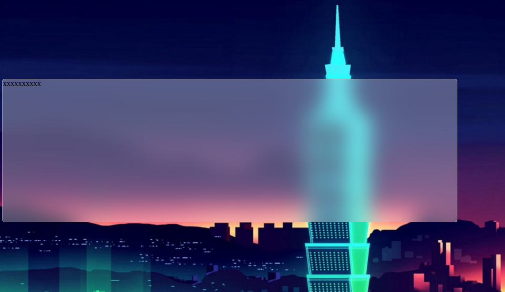

<h3>A glassmorphism blur effect css</h3>

April 2021 not working in Firefox 

Based in: <a href="https://www.youtube.com/watch?v=K4DhCQY5Izo">https://www.youtube.com/watch?v=K4DhCQY5Izo</a>

<h4>Capture</h4>

